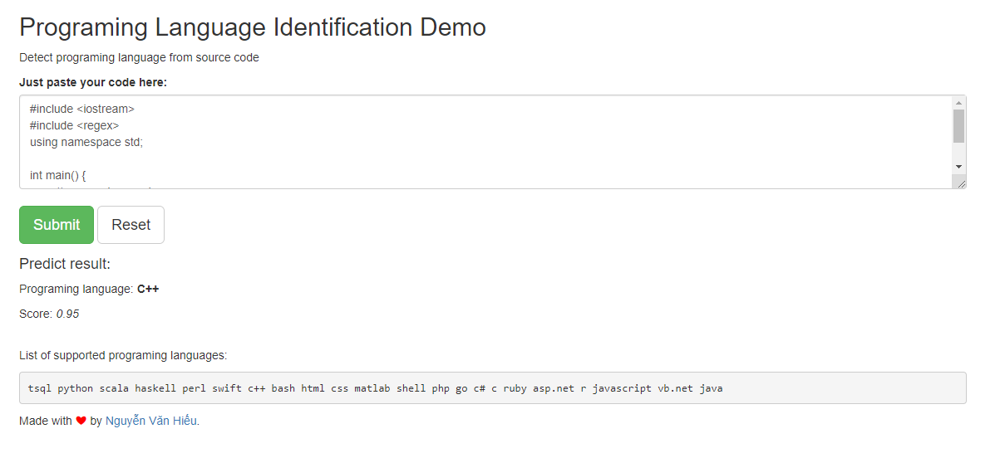

# Programing language prediction

Just give me your source code in plain text. I will guess you what programing languge of that text

List of supported programing languages:
```text
tsql python scala haskell perl swift c++ bash html css matlab shell php go c# c ruby asp.net r javascript vb.net java
```

### Prerequisites

- Python 3
- Fasttext

### Installing

```
pip install -r requirements.txt
```

### Training `classifier`
```text
- Prepare train-test set

python prepare_data.py

- Train

python train.py

```

### Accuracy
- Fasttext
```text
{
  "__lb__lang-r": 0.89,
  "__lb__lang-sh": 0.81,
  "__lb__lang-php": 0.85,
  "__lb__lang-c": 0.7,
  "__lb__lang-cpp": 0.78,
  "__lb__lang-rb": 0.82,
  "__lb__lang-java": 0.91,
  "__lb__lang-scala": 0.83,
  "__lb__lang-vb": 0.73,
  "__lb__lang-sql": 0.93,
  "__lb__lang-hs": 0.9,
  "__lb__lang-swift": 0.94,
  "__lb__lang-html": 0.85,
  "__lb__lang-matlab": 0.84,
  "__lb__lang-perl": 0.79,
  "__lb__lang-css": 0.97,
  "__lb__lang-py": 0.92,
  "__lb__lang-cs": 0.7,
  "__lb__lang-golang": 0.86
}
```
- Multinomial NB
```text
   micro avg       0.82      0.82      0.82     18512
   macro avg       0.86      0.77      0.80     18512
weighted avg       0.83      0.82      0.81     18512
```

- Linear SVC
```text
   micro avg       0.87      0.87      0.87     18512
   macro avg       0.86      0.85      0.85     18512
weighted avg       0.87      0.87      0.86     18512
```
- SGD Classifier
```text
   micro avg       0.84      0.84      0.84     18512
   macro avg       0.84      0.81      0.83     18512
weighted avg       0.84      0.84      0.84     18512
```
## Running the tests

Go to app solution and run with command:
```text
python app.py
```

Open browser at [localhost:5000/check](localhost:5000/check) and see how it work

## ScreenShots



## Data

You can find data at `data_crawler/data`

## License

This project is licensed under the MIT License - see the [LICENSE.md](LICENSE.md) file for details

## Acknowledgments

* Hat tip to anyone whose code was used
* Inspiration
* etc
